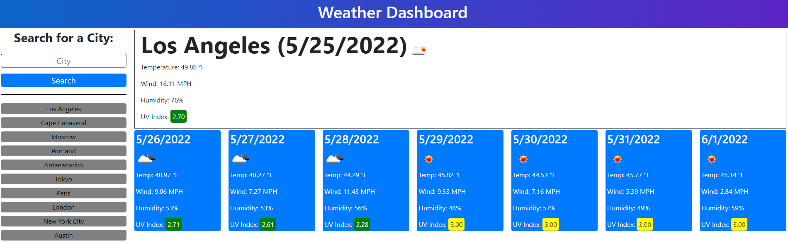
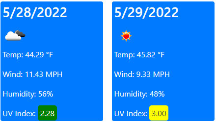
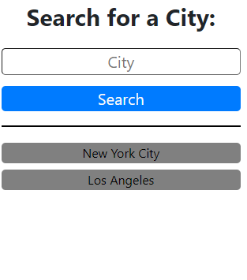
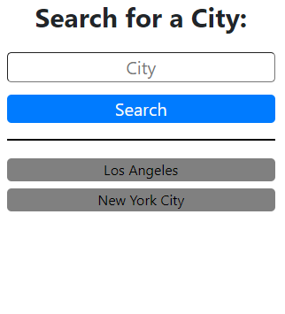
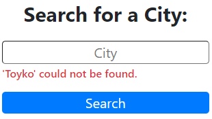
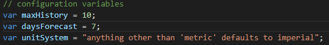

# How to Use

```
When you first load the page, you will be presented with a screen that has a labeled text input box and a search button.
```

```
Entering a city into the search box and submitting the form, either through clicking or pressing the "Enter" key, will search for the weather in the city.
The weather conditions displayed at the top of the page are the current weather conditions for the searched city.
Below the current conditions, there will be cards for the next several days of weather in that city.
Displayed conditions are: temperature, wind speed, humidity, uv index as well as an image representing the conditions, such as a sun for clear skies or a cloud for cloudy weather.
Displayed conditions for current weather are current, however conditions for future days are forecasted averages.
UV indexes will have a colored background indicating exposure levels. Green is low exposure, yellow is moderate, orange is high, red is very high.
```

```
Different colors of UV indexes will have different text colors for contrast.
```

```
Successfully searching for a city will create an item in the search history below the search area.
Multiple searches for the same city will not create duplicate items.
History items will be displayed chronologically, showing the most recent searches towards the top.
If a search is unsuccessful due to a spelling error or other invalid input, an error will display below the search box.
```
  

# Configuration

```
In assets/scripts/script.js there are some variables that can be changed to configure the page.
'maxHistory' controls the maximum number of history elements that will show.
'daysForecast' controls how many days of future weather forecast will be generated and shown. This has a maximum of 7 and scales dynamically with the page.
'unitSystem' controls whether imperial or metric units are used. The default is imperial, and metric will only be used if this is changed to 'metric' exactly.
Imperial units are: degrees fahrenheit, miles per hour. Metric units are: degrees celsius, meters per second.
```


# Links

[Github](https://github.com/tperschon/weatherboard)

[Live Site](https://tperschon.github.io/weatherboard/)